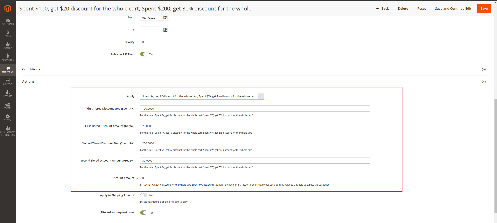

<h1 align="center">Zanui_TieredDiscount</h1>

## Overview

Tiered Discount extension adds one more Cart Rule action which allows to set up multiple discounts for one Cart Rule

## Installation

- Extract files from an archive
- In your Magento2 root directory, create this folder `app/code/Zanui/TieredDiscount`
- Copy all extracted files to the new folder
- Run this command to enable the extension `php bin/magento setup:upgrade`

## How To Use

### The tired discount rule
- Go to the backend area and create a new Cart Price Rule
- In the Actions section, select `Spent $X, get $Y discount for the whole cart; Spent $W, get Z% discount for the whole cart` option
- Complete some more required fields with the tiered discount rule that you want. For example, if the rule you want is `Spent $100, get $20 discount for the whole cart; Spent $200, get 30% discount for the whole cart`, the configuration should be:
    + First Tiered Discount Step (Spent $X): 100
    + First Tiered Discount Amount (Get $Y): 20
    + Second Tiered Discount Step (Spent $W): 200
    + Second Tiered Discount Amount (Get Z%): 30
    + Discount Amount: this can be any value to bypass the validation

### The custom message
- Go to the backend area and create a new Cart Price Rule.
- In the custom message section, add the error message and save.
- When guest or customer apply coupon invalid via API, the corresponding error message will be returned.
- Apply coupon for guest
```
- API URL: {baseUrl}/rest/default/V1/guest-carts/{{cartId}}/coupons/{couponCode}
- Method: PUT
- Authorization: Not required
- Body: Not required
```
- Apply coupon for customer
```
- API URL: {baseUrl}/rest/default/V1/carts/mine/coupons/{couponCode}
- Method: PUT 
- Authorization: {clientToken}
- Body: Not required
```


## License

[The Open Software License 3.0 (OSL-3.0)](https://opensource.org/licenses/OSL-3.0)
